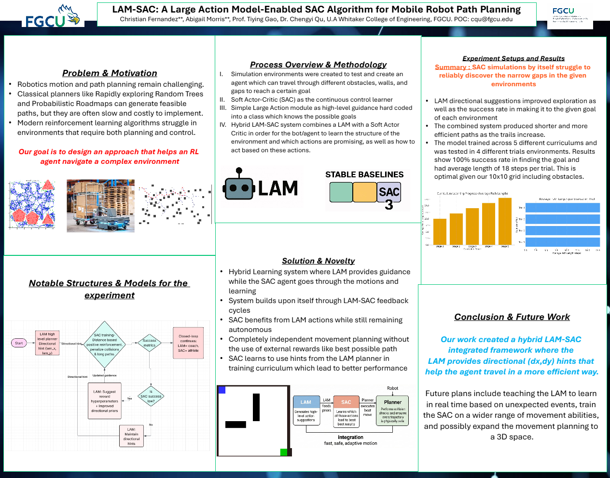
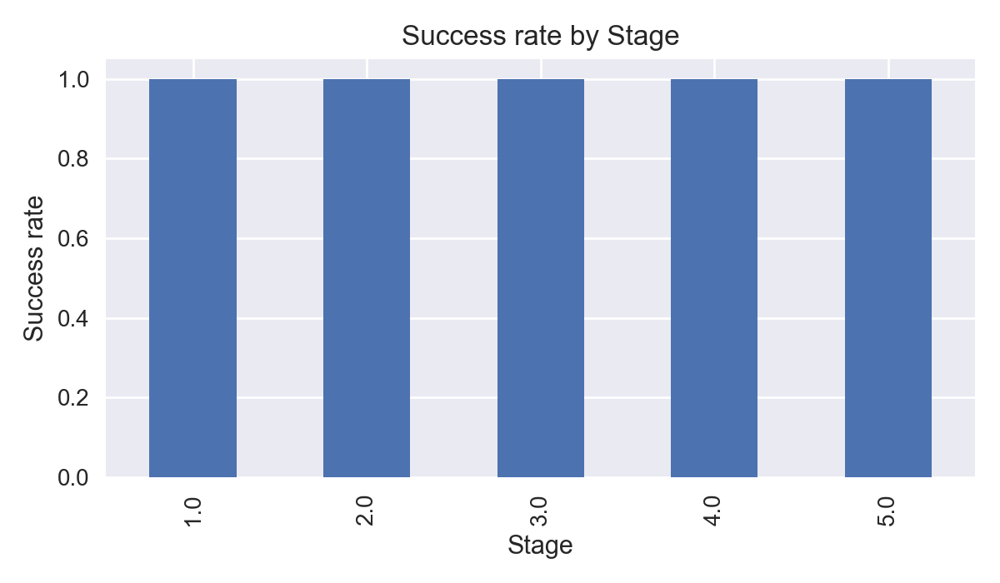

# LAM + SAC Gridworld



An experimental reinforcement-learning project that trains a Soft Actor-Critic (SAC) agent to navigate a 10 x 10 grid with blocked passages. A small Commander/LAM prototype turns simple text commands into reward-shaping context for training.



## What It Demonstrates

- A custom [Gymnasium](https://gymnasium.farama.org/) environment with walls, a single passage, configurable start and goal positions, and episode rendering.
- Continuous SAC actions mapped to cardinal grid moves, with rewards for progress and reaching the goal and penalties for time and collisions.
- A Commander-to-worker workflow: a lightweight keyword parser encodes a prompt, and a PyTorch network maps that context to reward settings.
- Policy evaluation and CSV logging across multiple goals and start/goal trials.

The Commander is a prototype, not a large language model. Prompt handling currently recognizes a small set of keywords (such as `fast`, `slow`, `careful`, and `reckless`); it does not understand arbitrary natural language.

## Recorded Results

The checked-in `training_log.csv` records a 1.00 success rate at each of five curriculum stages, evaluated over 100 episodes per stage by the curriculum script. The corresponding average episode lengths are 10, 12, 14, 16, and 18 steps as the goals move farther across the grid.

These are recorded run results, not a controlled comparison against a baseline. The repository also contains older comparison plots that are currently empty, so they are intentionally not presented as evidence of an improvement over vanilla SAC.

## Run the Commander Prototype

Use Python 3 and the dependencies in [`requirements.txt`](requirements.txt). In Windows PowerShell:

```powershell
py -m venv .venv
.\.venv\Scripts\Activate.ps1
python -m pip install -r requirements.txt
```

Start the Commander server in one terminal:

```powershell
python commander_terminal.py
```

Start the training worker in a second terminal:

```powershell
python train_trials.py
```

When the worker connects, enter a command such as `Run Trial 1` or `Go to 5,5 careful` in the Commander terminal. Training checkpoints are saved under `models/`.

To visualize a compatible saved checkpoint, use the viewer's `--trial` option (`start_x,start_y:goal_x,goal_y`):

```powershell
python watch_policy.py --model models/sac_lam_trials_final.zip --trial "0,0:9,9" --episodes 3
```

## Project Map

| File | Purpose |
| --- | --- |
| [`lam_sac_env.py`](lam_sac_env.py) | Gridworld, reward configuration, and LAM model |
| [`commander_terminal.py`](commander_terminal.py) | Parses commands and sends training missions |
| [`train_trials.py`](train_trials.py) | Connects to the Commander, trains/evaluates SAC, and saves a model |
| [`train_curriculum.py`](train_curriculum.py) | Older multi-goal curriculum runner and `training_log.csv` writer |
| [`watch_policy.py`](watch_policy.py) | Runs and renders saved policies for selected trials |
| [`figures/`](figures/) | Generated training and analysis figures |

## Current Limitations

- The curriculum and smoke-test scripts still use an older environment API and need alignment with the current environment implementation before they can be used as a clean reproduction path.
- The Commander uses keyword rules rather than a general-purpose language model, and the reward-shaping network is a research prototype rather than a validated learned language interface.
- Results are local run logs; random seeds and a reproducible baseline comparison are not currently documented.

## Tech Stack

Python · Gymnasium · Stable-Baselines3 · PyTorch · NumPy · Matplotlib
